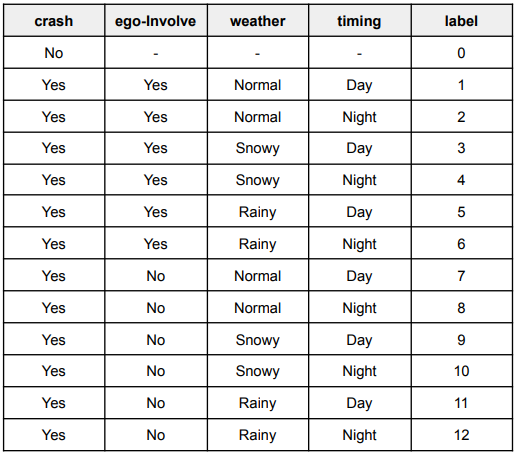
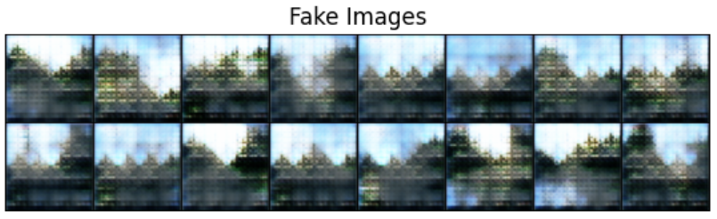

# 코스포 x 데이콘 자동차 충돌 분석 AI경진대회

### 대회 링크 : https://dacon.io/competitions/official/236064/data  

### 대회 Task : 차량 블랙박스 데이터에 대해 4개의 레이블을 분류하는 과제  
### Label    : Crash, ego-envolved, weather, timing

  
  
  
### 접근방식  
  
클래스 불균형이 매우 심하다.  0번 레이블은 1783개, 6번 레이블은 3개  
각 레이블별 학습을 따로 진행 -> 결과를 합치는 방식으로 접근  
  
weahter의 경우 동영상 프레임에서 이미지를 추출하여 이미지 데이터셋 구성 후 이미지 분류로 진행    
why : weather는 맥락의 중요도가 낮을 것이라는 가설 + 많은 데이터 확보 가능 + 이미지 모델이 더 가벼움

### 적용한 모델과 방법  
  
동영상 모델 : 3D-CNN, ResNet3D, Swin3D  
이미지 모델 : ResNet, EffificientNet, ViT, ConvNext, Swin-Transformer    

Data augmentation : Filp, Rotate, ColorJitter, Resize & Crop   
Class weight : weahter에 적용하여 class imbalance 문제를 해소  
3Frame Inference : weather 모델에서 추론할 때 50개의 프레임 중 0번 25번 49번 결과를 Hard-voting  
Data addition : 0번 레이블의 경우 weather에 대한 정보가 없음. 이를 학습된 모델에 넣어 logit > 0.8의 threshold를 도입해 학습 데이터에 추가  
Data addition with GAN : 비록 낮은 퀄리티의 결과로 적용하지 못 했지만 시도했음  
  
